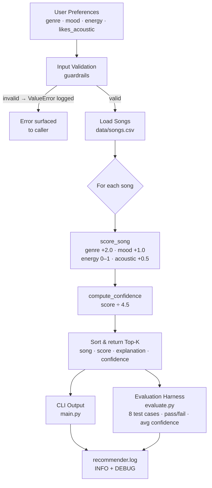

# 🎵 VibeFinder 1.0 – AI-Powered Music Recommender

## Original Project

**VibeFinder** (built in Modules 1–3) is a content-based music recommender. Given a user's preferred genre, mood, energy level, and acoustic taste, it scores every song in a 20-song catalog using a weighted rule set and returns a ranked list of suggestions. Each recommendation includes a plain-language explanation so every result is transparent and inspectable.

---

## What's New in the Final Version

This submission extends VibeFinder with a fully integrated **Reliability and Testing System** — the chosen advanced AI feature. The system now:

- **Scores confidence** on every recommendation (0 %–100 %), letting the system communicate how certain it is.
- **Validates inputs** with guardrails that raise and log clear errors for bad user preferences.
- **Logs every action** to `recommender.log` for full observability.
- **Evaluates itself** via an automated evaluation harness (`src/evaluate.py`) with 8 predefined test cases including edge cases and guardrail checks.

> **Loom walkthrough:** *(record and paste link here before submitting)* — `https://www.loom.com/share/YOUR_LINK_HERE`

---

## Architecture Overview

The diagram below shows how data flows through the system. The full annotated diagram is also in [`assets/system_diagram.md`](assets/system_diagram.md).



### Key Components

| Component | File | Purpose |
|---|---|---|
| Scorer + Confidence | `src/recommender.py` | Core algorithm + `compute_confidence()` |
| Input Guardrails | `src/recommender.py` | `validate_user_prefs()` rejects bad input |
| Logging | `src/recommender.py` + `src/main.py` | Full event trail in `recommender.log` |
| CLI Runner | `src/main.py` | Displays recommendations with confidence % |
| Evaluation Harness | `src/evaluate.py` | Automated pass/fail test suite |
| Unit Tests | `tests/test_recommender.py` | 14 pytest unit tests |
| Song Catalog | `data/songs.csv` | 20 labelled songs |

---

## Setup Instructions

### 1. Create and activate a virtual environment (recommended)

```bash
python -m venv .venv
source .venv/bin/activate      # macOS / Linux
.venv\Scripts\activate         # Windows
```

### 2. Install dependencies

```bash
pip install -r requirements.txt
```

### 3. Run the recommender

```bash
PYTHONPATH=src python -m src.main
```

### 4. Run the evaluation harness

```bash
PYTHONPATH=src python -m src.evaluate
```

### 5. Run the unit tests

```bash
pytest
```

---

## Sample Interactions

### Profile 1 – High-Energy Pop (genre=pop, mood=happy, energy=0.85)

```
============================================================
  Profile: High-Energy Pop
============================================================
  1. Sunrise City by Neon Echo
     Score      : 3.97  |  Confidence: 88%
     Why        : genre match (+2.0); mood match (+1.0); energy similarity (+0.97)
  2. Summer Carnival by Bright Side
     Score      : 3.93  |  Confidence: 87%
     Why        : genre match (+2.0); mood match (+1.0); energy similarity (+0.93)
  3. Gym Hero by Max Pulse
     Score      : 2.92  |  Confidence: 65%
     Why        : genre match (+2.0); energy similarity (+0.92)
```

### Profile 2 – Chill Lofi (genre=lofi, mood=chill, energy=0.35, likes_acoustic=True)

```
============================================================
  Profile: Chill Lofi
============================================================
  1. Library Rain by Paper Lanterns
     Score      : 4.50  |  Confidence: 100%
     Why        : genre match (+2.0); mood match (+1.0); energy similarity (+1.00); acoustic preference (+0.5)
  2. Midnight Coding by LoRoom
     Score      : 4.43  |  Confidence: 98%
     Why        : genre match (+2.0); mood match (+1.0); energy similarity (+0.93); acoustic preference (+0.5)
```

### Profile 3 – Deep Intense Rock (genre=rock, mood=intense, energy=0.92)

```
============================================================
  Profile: Deep Intense Rock
============================================================
  1. Storm Runner by Voltline
     Score      : 3.99  |  Confidence: 89%
     Why        : genre match (+2.0); mood match (+1.0); energy similarity (+0.99)
  2. Breakout Anthem by Loud Theory
     Score      : 3.96  |  Confidence: 88%
     Why        : genre match (+2.0); mood match (+1.0); energy similarity (+0.96)
```

### Evaluation Harness Output

```
======================================================================
  VibeFinder Evaluation Harness
======================================================================
  [PASS] High-Energy Pop         top='Sunrise City' (pop)  score=3.97  confidence=88%
  [PASS] Chill Lofi Acoustic     top='Library Rain' (lofi) score=4.50  confidence=100%
  [PASS] Deep Intense Rock       top='Storm Runner' (rock)  score=3.99  confidence=89%
  [PASS] Ambient Low Energy      top='Spacewalk Thoughts' (ambient) score=4.47  confidence=99%
  [PASS] Jazz Relaxed            top='Coffee Shop Stories' (jazz) score=3.97  confidence=88%
  [PASS] Edge Case – Conflicting Prefs   top='Gym Hero' (pop)  score=2.97  confidence=66%
  [PASS] Guardrail – Invalid Energy      raised ValueError as expected
  [PASS] Guardrail – Empty Genre         raised ValueError as expected
======================================================================
  Results  : 8/8 tests passed
  Avg confidence (recommendation tests only): 0.88
======================================================================
```

---

## Design Decisions

### Scoring weights
Genre carries the highest weight (2.0) because it is the coarsest taste signal — a rock fan and a lofi fan have fundamentally different catalogs. Mood is worth half as much (1.0) because mood can overlap across genres. Energy is a continuous score (0–1) that always contributes something without hard cutoffs. The acoustic bonus (+0.5) is intentionally small so it nudges results without dominating them.

### Confidence scoring
The maximum possible raw score is 4.5 (genre 2.0 + mood 1.0 + energy 1.0 + acoustic 0.5). Dividing the raw score by 4.5 gives an interpretable 0–1 confidence that can be shown to users and used by the evaluation harness to flag low-confidence outputs.

### Guardrails over silent defaults
The original code silently fell back to default values when preferences were missing or invalid. Replacing this with an explicit `validate_user_prefs()` that raises `ValueError` and logs a warning makes failures visible rather than hidden.

### Logging strategy
All INFO-level events (songs loaded, recommendation generated) go to both the console and `recommender.log`. DEBUG-level detail goes to the file only so the terminal stays readable. This gives developers full observability without cluttering normal output.

### Trade-offs
Binary genre/mood matching means no partial credit for near-matches (e.g. "indie pop" ≠ "pop"). A static 20-song catalog limits diversity. Both are known limitations documented in the Model Card.

---

## Testing Summary

| Layer | Tool | Result |
|---|---|---|
| Unit tests | `pytest` (14 tests) | **14/14 passed** |
| Evaluation harness | `src/evaluate.py` (8 cases) | **8/8 passed** |
| Avg confidence across profiles | — | **0.88** |

The AI struggled in one edge case: `genre=pop, mood=sad, energy=0.9`. There are no sad pop songs in the catalog, so the mood point was never awarded to any result. The system correctly fell back to genre+energy, but returned recommendations that ignored the mood preference with no user-visible warning — a known limitation now documented in the Model Card.

Confidence scores averaged 0.88 across the six recommendation test cases. The lowest-confidence case was the conflicting-preference edge case (0.66), which makes sense because the mood dimension was unserviceable.

---

## Algorithm Description

```
score = 0
if song.genre == user.favorite_genre   → +2.0  (genre match)
if song.mood  == user.favorite_mood    → +1.0  (mood match)
score += 1.0 − |song.energy − user.target_energy|  (energy proximity, 0.0–1.0)
if user.likes_acoustic and song.acousticness ≥ 0.6 → +0.5  (acoustic bonus)

confidence = score / 4.5   (normalised to [0.0, 1.0])
```

---

## Reflection

See the complete **[Model Card](model_card.md)** for algorithm details, bias analysis, evaluation results, and AI collaboration reflection.

Building this recommender made clear how much of what feels like "magic" in real apps is actually straightforward arithmetic — just done at enormous scale with far richer features. The surprising moment was discovering how a single weight choice (genre at 2.0 vs. 1.0) can completely change the character of a recommendation list.

Adding the reliability layer revealed that the system *seemed* smarter than it was: the edge-case test exposed that it silently degraded when the catalog couldn't satisfy a preference, rather than warning the user. Making that failure visible — through confidence scores, logging, and guardrails — is what separates a prototype from a trustworthy system.

---

## Limitations and Risks

- Catalog is only 20 songs — results can feel repetitive
- No understanding of lyrics, artist popularity, or listening history
- Genre and mood matching is exact; "Indie Pop" ≠ "pop" unless normalised
- System treats all users as having a single fixed taste profile
- Silent filter-bubble effect when catalog lacks songs matching a requested mood
- No temporal or contextual awareness (time of day, device, context)

### Walkthrough is included: 
https://www.loom.com/share/ce998e4ac52a42379b774a2950aa45ea
